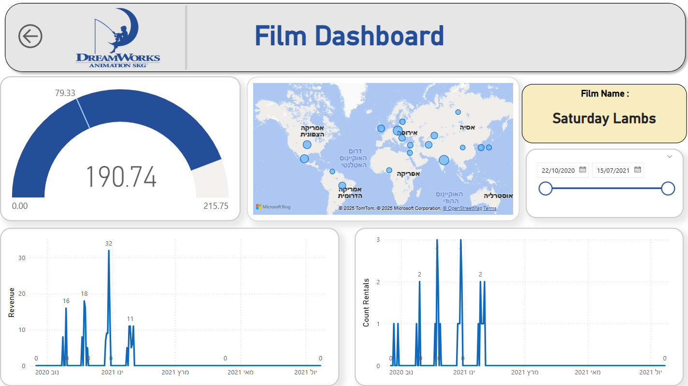

# 🎬 Film Rental Sales Analysis – Power BI Dashboard

Power BI project analyzing sales and rental data for a film rental company.

## 📈 Overview
- Built interactive dashboards to track revenue, rentals, and customer activity.
- Created custom DAX measures and connected tables for accurate insights.
- Focused on delivering clear, actionable visualizations for business decisions.

## 🖼 Dashboard Preview

## 📂 Download the Report

[📥 Download .pbix file](./Film_Rental_Analysis.pbix)

## 🛠 Tools
- Power BI  
- DAX  
- Data Modeling
